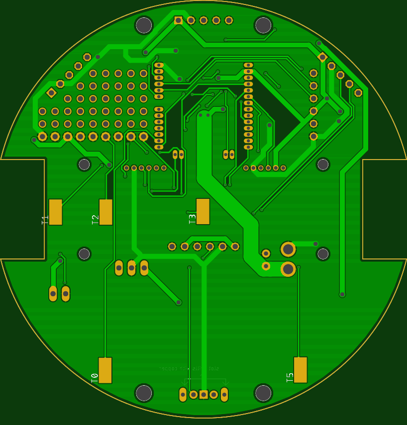
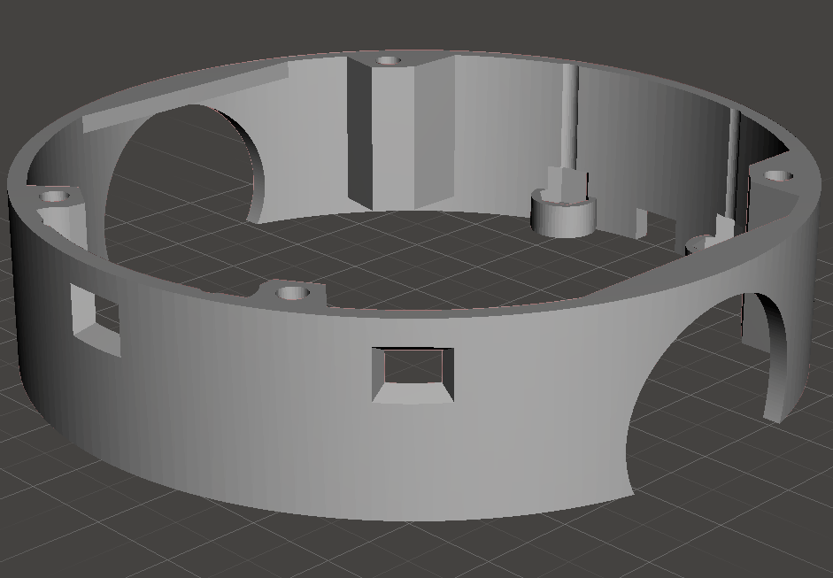
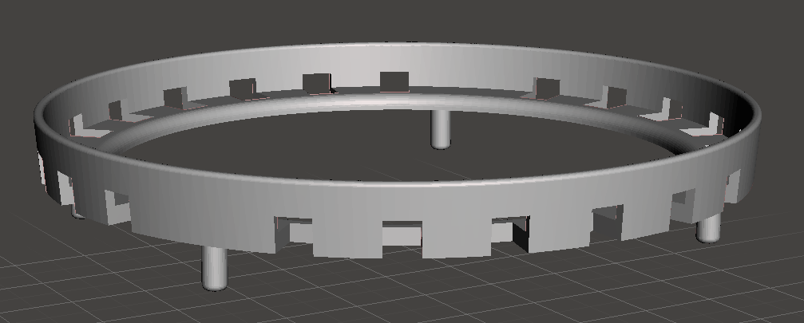

View this project on [CADLAB.io](https://cadlab.io/project/1962). 

### diff drive car by esp-wroom-32

Cuddling Alexa
### software
esp32、androidはソースコードの中

microbit:https://makecode.microbit.org/_AAq7xpe3sfrz

### hardware

モータマウント：https://www.thingiverse.com/thing:1364768
↑の12mmのやつ。

#### parts memo
- 100kオーム 1608 http://akizukidenshi.com/catalog/g/gR-11792/
- 5v 1a 縦型　 http://akizukidenshi.com/catalog/g/gI-00537/
    http://akizukidenshi.com/catalog/g/gM-13536/
    発熱がひどかったのでこっちに変更。6.5vから使えて最大1A、効率90-94%

    3.3V系統もBLEを使うと結構やばい。
    http://akizukidenshi.com/catalog/g/gM-13535/で設計すればよかった。
    
    回路設計時は入手性がよくてリポ2セル(最低6.4v)で動くスイッチングレギュレータ見つけられなかった・・・。

- 電源用mosfet http://akizukidenshi.com/catalog/g/gI-03942/
- 47uF http://akizukidenshi.com/catalog/g/gP-04657/
- 100uF http://akizukidenshi.com/catalog/g/gP-08290/
- モータードライバ　http://akizukidenshi.com/catalog/g/gI-11317/
- 3.3V 1.5A http://akizukidenshi.com/catalog/g/gI-02558/
- mos http://akizukidenshi.com/catalog/g/gI-01233/
- タクトスイッチ：http://akizukidenshi.com/catalog/g/gP-06185/
- モータコネクタzh 6pin　ｘ2：https://www.sengoku.co.jp/mod/sgk_cart/detail.php?code=4A44-P4HR
- リポ　2セル　3.7*2=7.4(6.4v-8.4v)　46ｘ20x 18未満
- LEDフルカラー4つ http://akizukidenshi.com/catalog/g/gI-07915/
- 電源コネクタ 　jstコネクタのメス
- ５Vアウトコネクタ　jstコネクタのメス　https://www.amazon.co.jp/SODIAL-R-10ペアの150mm-JSTコネクタープラグケーブルライン-オス＋メス-RC-BECリポ電池の為/dp/B00O2MPSU4/ref=sr_1_9?ie=UTF8&qid=1531495570&sr=8-9&keywords=jst
- 電源スイッチ, 横向き　http://akizukidenshi.com/catalog/g/gP-08789/
- ブザー http://akizukidenshi.com/catalog/g/gP-04497/
- アレクサ給電用microUSB:　http://www.epanorama.net/newepa/2016/04/27/qi-receiver-teardown/
- モータマウント m2 5mmぐらい4個　, M3　ネジ＋ナット　5㎜ぐらい ４個
- 距離センサ GY-530 3つ　4pin。10.5x13.3 https://www.smart-prototyping.com/VL53L0X-Time-of-Flight-Distance-Sensor-GY-530
- 9軸+気温+気圧　GY-91 (MPU9250+BMP280) 6pin　14.3mm * 20.5mm　https://electronics.semaf.at/9DOF-Axis-IMU-MPU9250-and-BMP280-Atmospheric-Sensor

1608の抵抗10k,20kとか
1608のコンデンサ0.1uF 10uFとか。